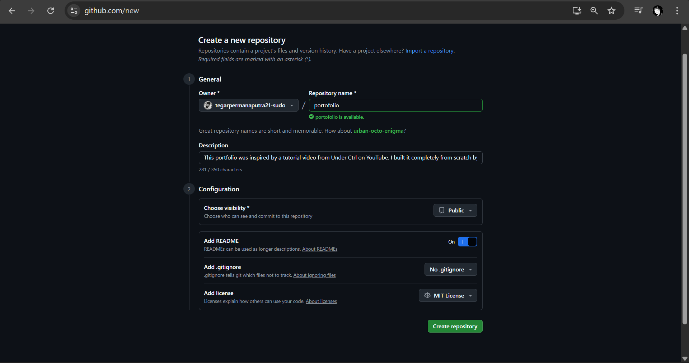

# Portofolio Pribadi di GitHub Pages

## A. Langkah-langkah Membuat Repository Baru di GitHub dan Mengaktifkan GitHub Pages

1. **Masuk ke GitHub** melalui [https://github.com](https://github.com).
2. Klik tombol **New Repository** atau buka tautan [https://github.com/new](https://github.com/new).
3. Isi data repository seperti berikut:
   - **Repository name:** `portofolio`
   - **Description:** isi dengan deskripsi singkat (contohnya: "This portfolio was inspired by a tutorial video from Under Ctrl on YouTube...")
   - **Visibility:** pilih **Public**
   - Tambahkan **README file** dan **MIT License** (opsional).
4. Klik tombol **Create repository** untuk membuat repository baru.

5. Setelah repository dibuat, upload file proyek kamu seperti `index.html`, `style.css`, dan folder `images`.
6. Pastikan semua file sudah masuk ke branch `main`.

7. Buka tab **Settings → Pages**.
8. Di bagian **Build and deployment**, atur sebagai berikut:
   - **Source:** `Deploy from a branch`
   - **Branch:** `main`
   - **Folder:** `/ (root)`
9. Klik **Save**, lalu tunggu hingga muncul tulisan:
   > Your site is live at https://username.github.io/portofolio/

